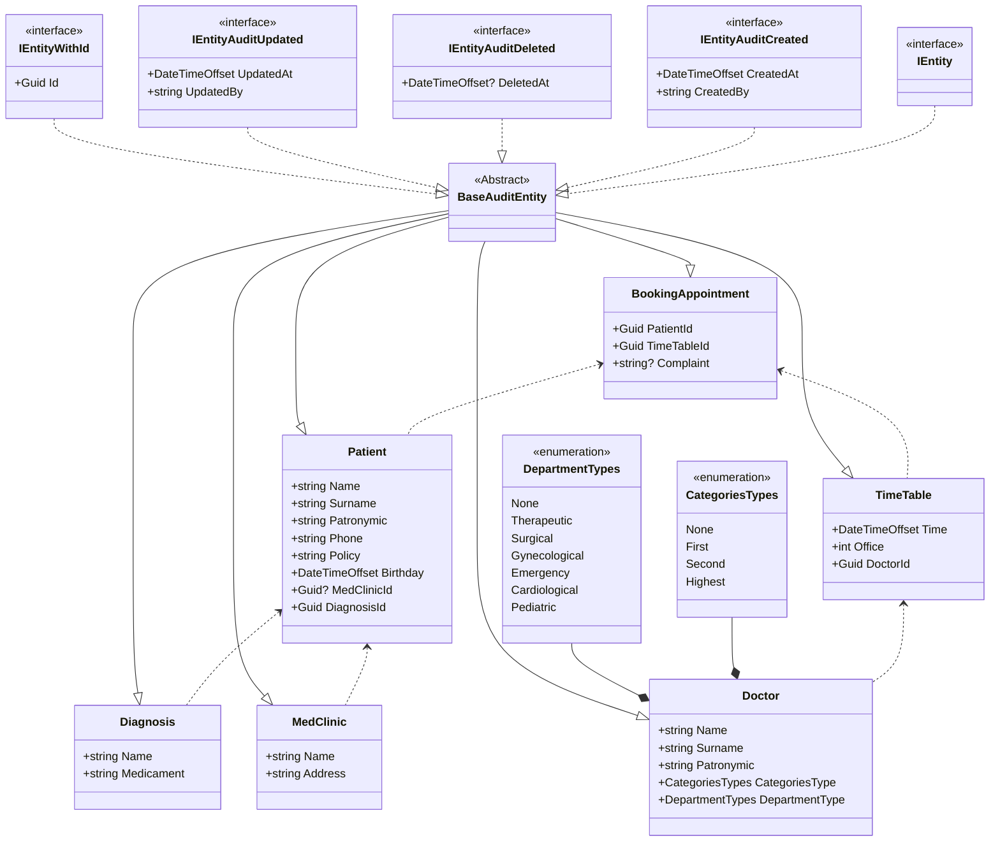

## Смирнова Кристина Алексеевна ИП-20-3
## Тема: Автоматизация записи на приём к врачу в поликлинику
## Пример бизнес сценария:

## Блок-схема mermaid взаимодействия сущностей



SQL скрипты по добавлению начальных данных:
---
```

INSERT INTO [dbo].[Diagnosis]
    ([Id],
    [Name],
    [Medicament],
    [CreatedAt],
    [CreatedBy],
    [UpdatedAt],
    [UpdatedBy],
    [DeletedAt]) 
VALUES 
    ('a6242442-d676-4b55-a043-4dddf9a6bfd2'
    ,N'Заложенность носа'
    ,N'Спрей Отривин'
    ,GETDATE() 
    ,'Insert' 
    ,GETDATE() 
    ,'Insert' 
    ,NULL)
INSERT INTO [dbo].[Diagnosis]
    ([Id],
    [Name],
    [Medicament],
    [CreatedAt],
    [CreatedBy],
    [UpdatedAt],
    [UpdatedBy],
    [DeletedAt]) 
VALUES 
    ('f767f8bf-2510-4296-a685-990cca7ef1eb' 
    ,N'Повышенное давление'
    ,N'Гипоксен'
    ,GETDATE() 
    ,'Insert' 
    ,GETDATE() 
    ,'Insert' 
    ,NULL)

INSERT INTO [dbo].[Doctors]
    ([Id],
    [Surname],
    [Name],
    [Patronymic],
    [CategoriesType],
    [DepartmentType],
    [CreatedAt],
    [CreatedBy],
    [UpdatedAt],
    [UpdatedBy],
    [DeletedAt]) 
VALUES 
    ('3323cbc0-af2d-4110-ba31-636bca8cc00e' 
    ,N'Смирнова' 
    ,N'Кристина' 
    ,N'Алексеевна' 
    ,2
    ,3
    ,GETDATE() 
    ,'Insert' 
    ,GETDATE() 
    ,'Insert' 
    ,NULL)
INSERT INTO [dbo].[Doctors]
    ([Id],
    [Surname],
    [Name],
    [Patronymic],
    [CategoriesType],
    [DepartmentType],
    [CreatedAt],
    [CreatedBy],
    [UpdatedAt],
    [UpdatedBy],
    [DeletedAt]) 
VALUES 
    ('fbd4800c-ad54-4af6-9dbb-624e0d8c9a22'
    ,N'Алейников'
    ,N'Кирилл'
    ,N'Сергеевич'
    ,3
    ,5
    ,GETDATE() 
    ,'Insert' 
    ,GETDATE() 
    ,'Insert' 
    ,NULL)

INSERT INTO [dbo].[MedClinics]
    ([Id],
    [Address],
    [Name],
    [CreatedAt],
    [CreatedBy],
    [UpdatedAt],
    [UpdatedBy],
    [DeletedAt])
VALUES
    ('da76529a-9ed5-40da-aa72-2bde68cdf50e'
    ,N'Подъездной пер., 2, Санкт-Петербург, 190013'
    ,N'СПб ГБУЗ Городская поликлиника №28'
    ,GETDATE() 
    ,'Insert' 
    ,GETDATE() 
    ,'Insert' 
    ,NULL)
INSERT INTO [dbo].[MedClinics]
    ([Id],
    [Address],
    [Name],
    [CreatedAt],
    [CreatedBy],
    [UpdatedAt],
    [UpdatedBy],
    [DeletedAt])
VALUES
    ('f7344f8e-7a3b-4e9c-bab3-20247ad34d8d'
    ,N'ул. Сикейроса, 10, Санкт-Петербург, 194354'
    ,N'СПб ГБУЗ Городская поликлиника №104'
    ,GETDATE() 
    ,'Insert' 
    ,GETDATE() 
    ,'Insert' 
    ,NULL)

INSERT INTO [dbo].[Patients]
    ([Id],
    [Surname],
    [Name],
    [Patronymic],
    [Phone],
    [Policy],
    [Birthday],
    [MedClinicId],
    [DiagnosisId],
    [CreatedAt],
    [CreatedBy],
    [UpdatedAt],
    [UpdatedBy],
    [DeletedAt])
VALUES
    ('81040bd2-15d0-4769-ae75-1ccd4b8e1709'
    ,N'Лукьянченко'
    ,N'Елена'
    ,N'Игоревна'
    ,N'89317852439'
    ,8263549182734543
    ,N'08.06.2004 4:20:00 +00:00'
    ,'da76529a-9ed5-40da-aa72-2bde68cdf50e'
    ,'a6242442-d676-4b55-a043-4dddf9a6bfd2'
    ,GETDATE() 
    ,'Insert' 
    ,GETDATE() 
    ,'Insert' 
    ,NULL)
INSERT INTO [dbo].[Patients]
    ([Id],
    [Surname],
    [Name],
    [Patronymic],
    [Phone],
    [Policy],
    [Birthday],
    [MedClinicId],
    [DiagnosisId],
    [CreatedAt],
    [CreatedBy],
    [UpdatedAt],
    [UpdatedBy],
    [DeletedAt])
VALUES
    ('0edf1040-c981-4d6d-8146-4244bbb92170'
    ,N'Бугорцев'
    ,N'Виктор'
    ,N'Алмазович'
    ,N'89319852215'
    ,9342189032476829
    ,N'01.10.1999 2:10:00 +00:00'
    ,'f7344f8e-7a3b-4e9c-bab3-20247ad34d8d'
    ,'f767f8bf-2510-4296-a685-990cca7ef1eb'
    ,GETDATE() 
    ,'Insert' 
    ,GETDATE() 
    ,'Insert' 
    ,NULL)

INSERT INTO [dbo].[TimeTables]
    ([Id],
    [Time],
    [Office],
    [DoctorId],
    [CreatedAt],
    [CreatedBy],
    [UpdatedAt],
    [UpdatedBy],
    [DeletedAt])
VALUES
    ('56f26594-6b70-4fef-b27c-e269917d73ce'
    ,N'01.11.2024 13:15:00 +00:00'
    ,414
    ,'3323cbc0-af2d-4110-ba31-636bca8cc00e'
    ,GETDATE() 
    ,'Insert' 
    ,GETDATE() 
    ,'Insert' 
    ,NULL)
INSERT INTO [dbo].[TimeTables]
    ([Id],
    [Time],
    [Office],
    [DoctorId],
    [CreatedAt],
    [CreatedBy],
    [UpdatedAt],
    [UpdatedBy],
    [DeletedAt])
VALUES
    ('bf0ed196-6fc6-4d6c-9dd0-7e5a681e9c1c'
    ,N'12.30.2023 10:00:00 +00:00'
    ,110
    ,'fbd4800c-ad54-4af6-9dbb-624e0d8c9a22'
    ,GETDATE() 
    ,'Insert' 
    ,GETDATE() 
    ,'Insert' 
    ,NULL)

INSERT INTO [dbo].[BookingAppointments]
    ([Id],
    [PatientId],
    [TimeTableId],
    [Complaint],
    [CreatedAt],
    [CreatedBy],
    [UpdatedAt],
    [UpdatedBy],
    [DeletedAt])
VALUES
    ('c9492e20-0820-4cda-9f59-a259af1bf6c2'
    ,'81040bd2-15d0-4769-ae75-1ccd4b8e1709'
    ,'56f26594-6b70-4fef-b27c-e269917d73ce'
    ,N'Сухость в носу и температура'
    ,GETDATE() 
    ,'Insert' 
    ,GETDATE() 
    ,'Insert' 
    ,NULL)
INSERT INTO [dbo].[BookingAppointments]
    ([Id],
    [PatientId],
    [TimeTableId],
    [Complaint],
    [CreatedAt],
    [CreatedBy],
    [UpdatedAt],
    [UpdatedBy],
    [DeletedAt])
VALUES
    ('633667fb-5c1d-44e0-adba-65c6a5cc3410'
    ,'0edf1040-c981-4d6d-8146-4244bbb92170'
    ,'bf0ed196-6fc6-4d6c-9dd0-7e5a681e9c1c'
    ,N'Кружится голова'
    ,GETDATE() 
    ,'Insert' 
    ,GETDATE() 
    ,'Insert' 
    ,NULL)
```
