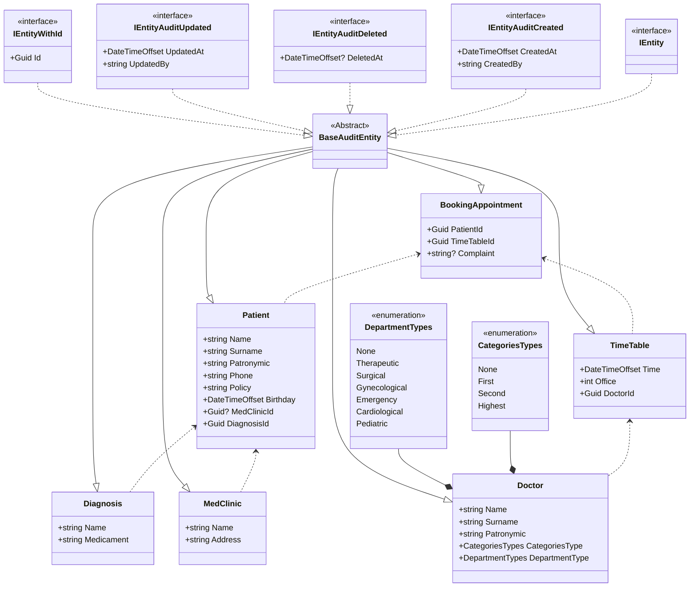

## Смирнова Кристина Алексеевна ИП-20-3
## Тема: Автоматизация записи на приём к врачу в поликлинику
## Пример бизнес сценария:

## Блок-схема mermaid взаимодействия сущностей



## SQL скрипты по добавлению начальных данных:

```
--Записи
INSERT INTO [dbo].[BookingAppointments]
    ([Id],
    [PatientId],
    [TimeTableId],
    [Сomplaint],
    [CreatedAt],
    [CreatedBy],
    [UpdatedAt],
    [UpdatedBy],
    [DeletedAt])
VALUES
    ('5a37c538-d5f8-4cbc-ac6b-20895cf5ca25',
    '9a44ea91-5cce-4a55-b104-b08b0c7518c8',
    '7fd87856-8785-4c20-8329-4ba03bc70c7c',
    'Болезнь',
    ,GETDATE() 
    ,'Insert' 
    ,GETDATE() 
    ,'Insert' 
    NULL)
INSERT INTO [dbo].[BookingAppointments]
    ([Id],
    [PatientId],
    [TimeTableId],
    [Сomplaint],
    [CreatedAt],
    [CreatedBy],
    [UpdatedAt],
    [UpdatedBy],
    [DeletedAt])
VALUES
    ('5a37c538-d5f8-4cbc-ac6b-20895cf5ca25',
    '9a44ea91-5cce-4a55-b104-b08b0c7518c8',
    '7fd87856-8785-4c20-8329-4ba03bc70c7c',
    'Болезнь',
    ,GETDATE() 
    ,'Insert' 
    ,GETDATE() 
    ,'Insert' 
    NULL)


--Диагнозы
INSERT INTO [dbo].[Diagnosis]
    ([Id],
    [Name],
    [Medicament],
    [CreatedAt],
    [CreatedBy],
    [UpdatedAt],
    [UpdatedBy],
    [DeletedAt]) 
VALUES 
    ('e4709f75-38ad-4871-ac9b-4481d911e97d', 
    'Заложенность носа', 
    'Спрей Отривин', 
    ,GETDATE() 
    ,'Insert' 
    ,GETDATE() 
    ,'Insert' 
    NULL)
INSERT INTO [dbo].[Diagnosis]
    ([Id],
    [Name],
    [Medicament],
    [CreatedAt],
    [CreatedBy],
    [UpdatedAt],
    [UpdatedBy],
    [DeletedAt]) 
VALUES 
    ('95bd4bc5-f126-49ee-8f41-7d825d8fdc8e', 
    'Повышенное давление', 
    'Гипоксен', 
    ,GETDATE() 
    ,'Insert' 
    ,GETDATE() 
    ,'Insert' 
    NULL)


--Врачи:
INSERT INTO [dbo].[Doctors]
    ([Id],
    [Surname],
    [Name],
    [Patronymic],
    [CategoriesType],
    [DepartmentType],
    [CreatedAt],
    [CreatedBy],
    [UpdatedAt],
    [UpdatedBy],
    [DeletedAt]) 
VALUES 
    ('2ff553c7-132f-4dc5-b692-d77f020c88ae', 
    'Смирнова', 
    'Кристина', 
    'Алексеевна', 
    2, 
    3, 
    ,GETDATE() 
    ,'Insert' 
    ,GETDATE() 
    ,'Insert' 
    NULL)
INSERT INTO [dbo].[Doctors]
    ([Id],
    [Surname],
    [Name],
    [Patronymic],
    [CategoriesType],
    [DepartmentType],
    [CreatedAt],
    [CreatedBy],
    [UpdatedAt],
    [UpdatedBy],
    [DeletedAt]) 
VALUES 
    ('3ff553c7-132f-4dc5-b692-d77f020c88ae', 
    'Алейников', 
    'Кирилл', 
    'Сергеевич', 
    3, 
    5, 
    ,GETDATE() 
    ,'Insert' 
    ,GETDATE() 
    ,'Insert' 
    NULL)


--Поликлиники:
INSERT INTO [dbo].[MedClinics]
    ([Id],
    [Address],
    [Name],
    [CreatedAt],
    [CreatedBy],
    [UpdatedAt],
    [UpdatedBy],
    [DeletedAt])
VALUES
    ('bf052888-b32f-4047-87c2-2d37f94aec99',
    'Подъездной пер., 2, Санкт-Петербург, 190013', N'СПб ГБУЗ Городская поликлиника №28',
    ,GETDATE() 
    ,'Insert' 
    ,GETDATE() 
    ,'Insert' 
    NULL)
INSERT INTO [dbo].[MedClinics]
    ([Id],
    [Address],
    [Name],
    [CreatedAt],
    [CreatedBy],
    [UpdatedAt],
    [UpdatedBy],
    [DeletedAt])
VALUES
    ('bf052888-b32f-4047-87c2-2d37f94aec99',
    'Подъездной пер., 2, Санкт-Петербург, 190013', N'СПб ГБУЗ Городская поликлиника №28',
    ,GETDATE() 
    ,'Insert' 
    ,GETDATE() 
    ,'Insert' 
    NULL)

--Пациенты:
INSERT INTO [dbo].[Patients]
    ([Id],
    [Surname],
    [Name],
    [Patronymic],
    [Phone],
    [Policy],
    [Birthday],
    [MedClinicId],
    [DiagnosisId],
    [CreatedAt],
    [CreatedBy],
    [UpdatedAt],
    [UpdatedBy],
    [DeletedAt])
VALUES
    ('9a44ea91-5cce-4a55-b104-b08b0c7518c8',
    'Лукьянченко',
    'Елена',
    'Игоревна',
    '89317852439',
    8263549182734543,
    '08.06.2004 4:20:00 +00:00',
    'bf052888-b32f-4047-87c2-2d37f94aec99',
    '2201e1db-4588-4c95-ba2f-9f1e228ca0fb',
    ,GETDATE() 
    ,'Insert' 
    ,GETDATE() 
    ,'Insert' 
    NULL)
INSERT INTO [dbo].[Patients]
    ([Id],
    [Surname],
    [Name],
    [Patronymic],
    [Phone],
    [Policy],
    [Birthday],
    [MedClinicId],
    [DiagnosisId],
    [CreatedAt],
    [CreatedBy],
    [UpdatedAt],
    [UpdatedBy],
    [DeletedAt])
VALUES
    ('9a44ea91-5cce-4a55-b104-b08b0c7518c8',
    'Лукьянченко',
    'Елена',
    'Игоревна',
    '89317852439',
    8263549182734543,
    '08.06.2004 4:20:00 +00:00',
    'bf052888-b32f-4047-87c2-2d37f94aec99',
    '2201e1db-4588-4c95-ba2f-9f1e228ca0fb',
    ,GETDATE() 
    ,'Insert' 
    ,GETDATE() 
    ,'Insert' 
    NULL)


--Рассписание
INSERT INTO [dbo].[TimeTables]
    ([Id],
    [Time],
    [Office],
    [DoctorId],
    [CreatedAt],
    [CreatedBy],
    [UpdatedAt],
    [UpdatedBy],
    [DeletedAt])
VALUES
    ('7fd87856-8785-4c20-8329-4ba03bc70c7c',
    '23.12.2023 10:09:24 +00:00',
    110,
    '2ff553c7-132f-4dc5-b692-d77f020c88ae',
    ,GETDATE() 
    ,'Insert' 
    ,GETDATE() 
    ,'Insert' 
    NULL)
INSERT INTO [dbo].[TimeTables]
    ([Id],
    [Time],
    [Office],
    [DoctorId],
    [CreatedAt],
    [CreatedBy],
    [UpdatedAt],
    [UpdatedBy],
    [DeletedAt])
VALUES
    ('7fd87856-8785-4c20-8329-4ba03bc70c7c',
    '23.12.2023 10:09:24 +00:00',
    110,
    '2ff553c7-132f-4dc5-b692-d77f020c88ae',
    ,GETDATE() 
    ,'Insert' 
    ,GETDATE() 
    ,'Insert' 
    NULL)

```
