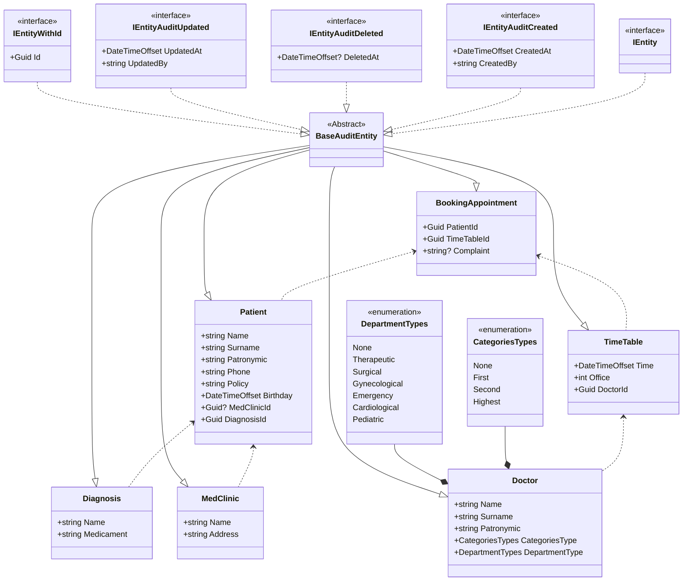

```mermaid
classDiagram
    Patient <.. Diagnosis
    TimeTable <.. Doctor
    BookingAppointment <.. Patient
    Patient <.. MedClinic
    BookingAppointment <.. TimeTable
    CategoriesTypes --* Doctor
    DepartmentTypes --* Doctor
    BaseAuditEntity --|> Patient
    BaseAuditEntity --|> Diagnosis
    BaseAuditEntity --|> BookingAppointment
    BaseAuditEntity --|> TimeTable
    BaseAuditEntity --|> Doctor
    BaseAuditEntity --|> MedClinic
    IEntity ..|> BaseAuditEntity
    IEntityAuditCreated ..|> BaseAuditEntity
    IEntityAuditDeleted ..|> BaseAuditEntity
    IEntityAuditUpdated ..|> BaseAuditEntity
    IEntityWithId ..|> BaseAuditEntity
    class IEntity{
        <<interface>>
    }
    class IEntityAuditCreated{
        <<interface>>
        +DateTimeOffset CreatedAt
        +string CreatedBy
    }
    class IEntityAuditDeleted{
        <<interface>>
        +DateTimeOffset? DeletedAt
    }
    class IEntityAuditUpdated{
        <<interface>>
        +DateTimeOffset UpdatedAt
        +string UpdatedBy
    }
    class IEntityWithId{
        <<interface>>
        +Guid Id
    }        
    class BookingAppointment{
        +Guid PatientId
        +Guid TimeTableId
        +string? Complaint
    }
    class Diagnosis{
        +string Name
        +string Medicament
    }
    class Doctor {
        +string Name
        +string Surname
        +string Patronymic
        +CategoriesTypes CategoriesType
        +DepartmentTypes DepartmentType
    }
    class MedClinic {
        +string Name
        +string Address
    }
    class Patient {
        +string Name
        +string Surname
        +string Patronymic
        +string Phone
        +string Policy
        +DateTimeOffset Birthday
        +Guid? MedClinicId
        +Guid DiagnosisId
    }
    class TimeTable {
        +DateTimeOffset Time 
        +int Office
        +Guid DoctorId        
    }
    class CategoriesTypes {
        <<enumeration>>
        None
        First
        Second
        Highest
    }
    class DepartmentTypes {
        <<enumeration>>
        None
        Therapeutic
        Surgical
        Gynecological
        Emergency
        Cardiological
        Pediatric
    }
    class BaseAuditEntity {
        <<Abstract>>        
    }
```