# Смирнова Кристина Алексеевна ИП-20-3
## Тема: Автоматизация записи на приём к врачу в поликлинику
## Пример бизнес сценария:

## Блок-схема mermaid взаимодействия сущностей

```mermaid
classDiagram
    Patient <.. Diagnosis
    TimeTable <.. Doctor
    BookingAppointment <.. Patient
    Patient <.. MedClinic
    BookingAppointment <.. TimeTable
    CategoriesTypes --* Doctor
    DepartmentTypes --* Doctor
    BaseAuditEntity --|> Patient
    BaseAuditEntity --|> Diagnosis
    BaseAuditEntity --|> BookingAppointment
    BaseAuditEntity --|> TimeTable
    BaseAuditEntity --|> Doctor
    BaseAuditEntity --|> MedClinic
    IEntity ..|> BaseAuditEntity
    IEntityAuditCreated ..|> BaseAuditEntity
    IEntityAuditDeleted ..|> BaseAuditEntity
    IEntityAuditUpdated ..|> BaseAuditEntity
    IEntityWithId ..|> BaseAuditEntity
    class IEntity{
        <<interface>>
    }
    class IEntityAuditCreated{
        <<interface>>
        +DateTimeOffset CreatedAt
        +string CreatedBy
    }
    class IEntityAuditDeleted{
        <<interface>>
        +DateTimeOffset? DeletedAt
    }
    class IEntityAuditUpdated{
        <<interface>>
        +DateTimeOffset UpdatedAt
        +string UpdatedBy
    }
    class IEntityWithId{
        <<interface>>
        +Guid Id
    }        
    class BookingAppointment{
        +Guid PatientId
        +Guid TimeTableId
        +string? Complaint
    }
    class Diagnosis{
        +string Name
        +string Medicament
    }
    class Doctor {
        +string Name
        +string Surname
        +string Patronymic
        +CategoriesTypes CategoriesType
        +DepartmentTypes DepartmentType
    }
    class MedClinic {
        +string Name
        +string Address
    }
    class Patient {
        +string Name
        +string Surname
        +string Patronymic
        +string Phone
        +string Policy
        +DateTimeOffset Birthday
        +Guid? MedClinicId
        +Guid DiagnosisId
    }
    class TimeTable {
        +DateTimeOffset Time 
        +int Office
        +Guid DoctorId        
    }
    class CategoriesTypes {
        <<enumeration>>
        None
        First
        Second
        Highest
    }
    class DepartmentTypes {
        <<enumeration>>
        None
        Therapeutic
        Surgical
        Gynecological
        Emergency
        Cardiological
        Pediatric
    }
    class BaseAuditEntity {
        <<Abstract>>        
    }
```



SQL скрипты по добавлению начальных данных:
---
```
--Диагнозы:
INSERT INTO [dbo].[Diagnosis] ([Id], [Name], [Medicament], [CreatedAt], [CreatedBy], [UpdatedAt], [UpdatedBy], [DeletedAt]) 
VALUES 
(N'e4709f75-38ad-4871-ac9b-4481d911e97d', 
N'Заложенность носа', 
N'Спрей Отривин', 
N'22.12.2023 10:54:23 +00:00', 
N'Clinic.API', 
N'22.12.2023 10:54:23 +00:00', 
N'Clinic.API', 
NULL)
INSERT INTO [dbo].[Diagnosis] ([Id], [Name], [Medicament], [CreatedAt], [CreatedBy], [UpdatedAt], [UpdatedBy], [DeletedAt]) 
VALUES 
(N'95bd4bc5-f126-49ee-8f41-7d825d8fdc8e', 
N'Повышенное давление', 
N'Гипоксен', 
N'22.12.2023 10:55:22 +00:00', 
N'Clinic.API', 
N'22.12.2023 10:55:22 +00:00', 
N'Clinic.API', 
NULL)


--Врачи:
INSERT INTO [dbo].[Doctors] ([Id], [Surname], [Name], [Patronymic], [CategoriesType], [DepartmentType], [CreatedAt], [CreatedBy], [UpdatedAt], [UpdatedBy], [DeletedAt]) 
VALUES 
(N'2ff553c7-132f-4dc5-b692-d77f020c88ae', 
N'Смирнова', 
N'Кристина', 
N'Алексеевна', 
2, 
3, 
N'10.12.2023 17:56:57 +00:00', 
N'Clinic.API', 
N'10.12.2023 17:56:57 +00:00', 
N'Clinic.API', NULL)
INSERT INTO [dbo].[Doctors] ([Id], [Surname], [Name], [Patronymic], [CategoriesType], [DepartmentType], [CreatedAt], [CreatedBy], [UpdatedAt], [UpdatedBy], [DeletedAt]) 
VALUES 
(N'3ff553c7-132f-4dc5-b692-d77f020c88ae', 
N'Алейников', 
N'Кирилл', 
N'Сергеевич', 
3, 
5, 
N'12.12.2023 19:07:30 +00:00', 
N'Clinic.API', 
N'12.12.2023 19:07:30 +00:00', 
N'Clinic.API', 
NULL)
```
